# Pele / Mermaid 12.1.0 手动测试

示例摘自 Mermaid 官方仓库的 12.1.0 标签文档，各节附原文链接。

## 官方图表样例

### 流程图

[Mermaid 12.1.0 官方示例](https://github.com/mermaid-js/mermaid/blob/mermaid%4012.1.0/packages/mermaid/src/docs/syntax/flowchart.md)

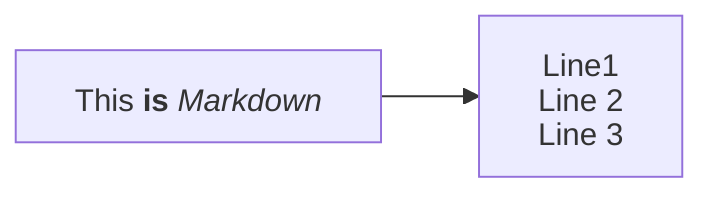
```mermaid
---
config:
  htmlLabels: false
---
flowchart LR
    markdown["`This **is** _Markdown_`"]
    newLines["`Line1
    Line 2
    Line 3`"]
    markdown --> newLines
```

### 时序图

[Mermaid 12.1.0 官方示例](https://github.com/mermaid-js/mermaid/blob/mermaid%4012.1.0/packages/mermaid/src/docs/syntax/sequenceDiagram.md)

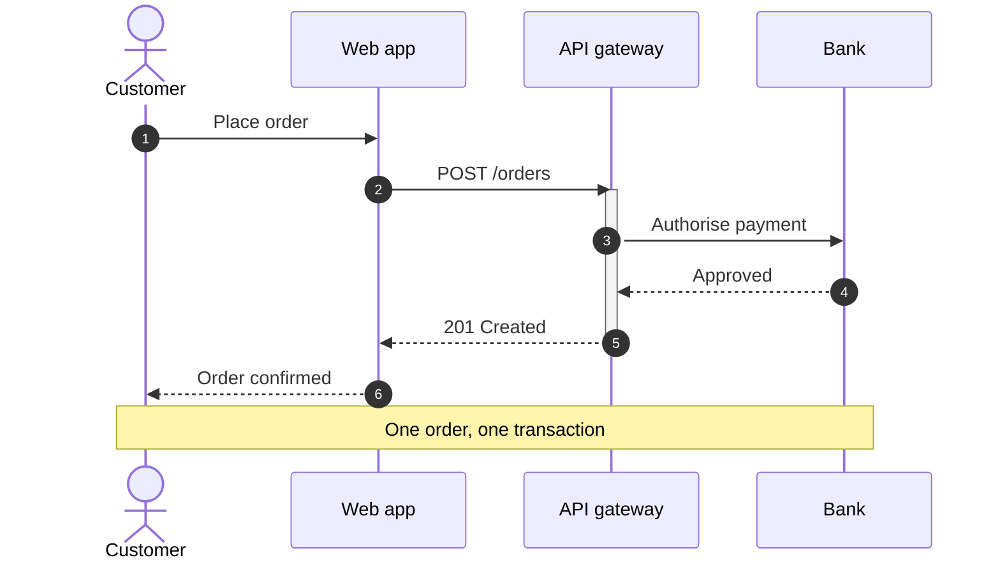
```mermaid
sequenceDiagram
  autonumber
  actor Customer
  participant Web as Web app
  participant API as API gateway
  participant Bank
  Customer->>Web: Place order
  Web->>API: POST /orders
  activate API
  API->>Bank: Authorise payment
  Bank-->>API: Approved
  API-->>Web: 201 Created
  deactivate API
  Web-->>Customer: Order confirmed
  Note over Customer,Bank: One order, one transaction
```

### 类图

[Mermaid 12.1.0 官方示例](https://github.com/mermaid-js/mermaid/blob/mermaid%4012.1.0/packages/mermaid/src/docs/syntax/classDiagram.md)

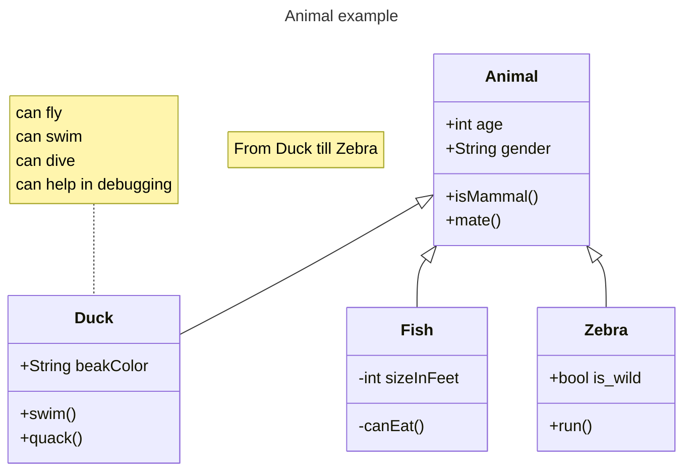
```mermaid
---
title: Animal example
---
classDiagram
    note "From Duck till Zebra"
    Animal <|-- Duck
    note for Duck "can fly<br>can swim<br>can dive<br>can help in debugging"
    Animal <|-- Fish
    Animal <|-- Zebra
    Animal : +int age
    Animal : +String gender
    Animal: +isMammal()
    Animal: +mate()
    class Duck{
        +String beakColor
        +swim()
        +quack()
    }
    class Fish{
        -int sizeInFeet
        -canEat()
    }
    class Zebra{
        +bool is_wild
        +run()
    }
```

### 状态图

[Mermaid 12.1.0 官方示例](https://github.com/mermaid-js/mermaid/blob/mermaid%4012.1.0/packages/mermaid/src/docs/syntax/stateDiagram.md)

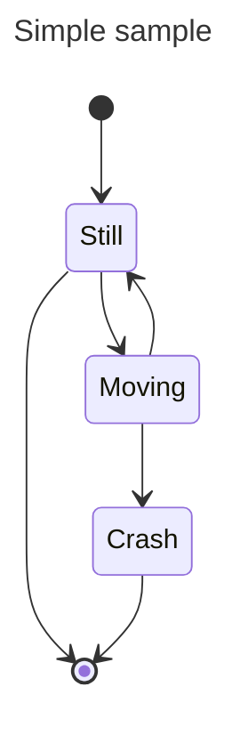
```mermaid
---
title: Simple sample
---
stateDiagram-v2
    [*] --> Still
    Still --> [*]

    Still --> Moving
    Moving --> Still
    Moving --> Crash
    Crash --> [*]
```

### 实体关系图

[Mermaid 12.1.0 官方示例](https://github.com/mermaid-js/mermaid/blob/mermaid%4012.1.0/packages/mermaid/src/docs/syntax/entityRelationshipDiagram.md)

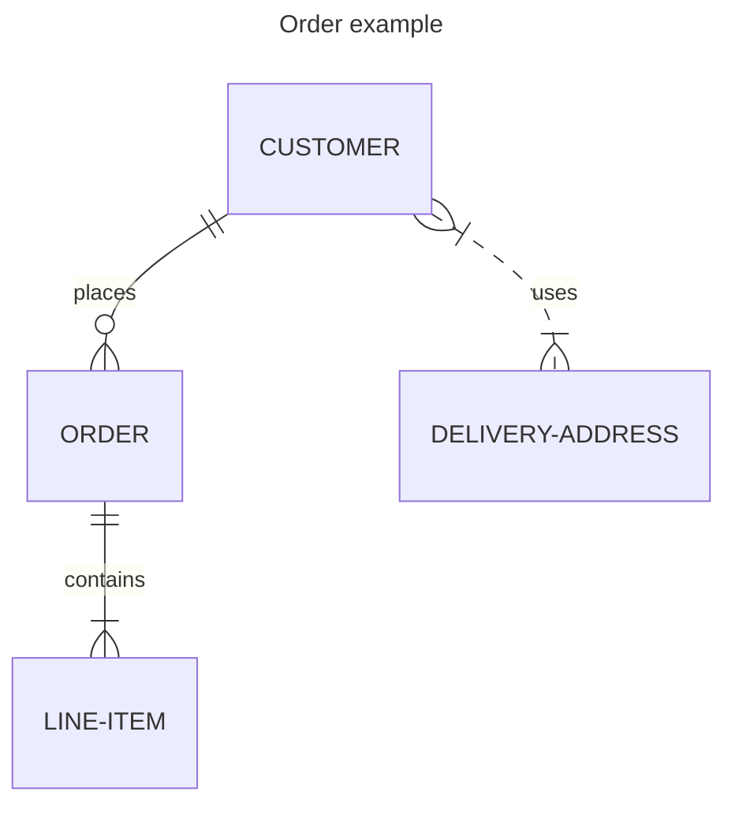
```mermaid
---
title: Order example
---
erDiagram
    CUSTOMER ||--o{ ORDER : places
    ORDER ||--|{ LINE-ITEM : contains
    CUSTOMER }|..|{ DELIVERY-ADDRESS : uses
```

### 用户旅程

[Mermaid 12.1.0 官方示例](https://github.com/mermaid-js/mermaid/blob/mermaid%4012.1.0/packages/mermaid/src/docs/syntax/userJourney.md)

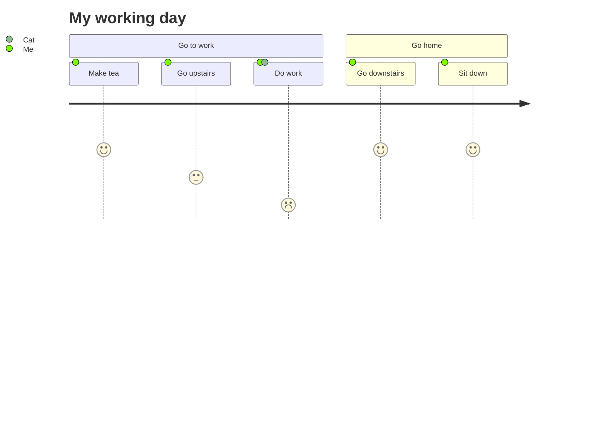
```mermaid
journey
    title My working day
    section Go to work
      Make tea: 5: Me
      Go upstairs: 3: Me
      Do work: 1: Me, Cat
    section Go home
      Go downstairs: 5: Me
      Sit down: 5: Me
```

### 甘特图

[Mermaid 12.1.0 官方示例](https://github.com/mermaid-js/mermaid/blob/mermaid%4012.1.0/packages/mermaid/src/docs/syntax/gantt.md)

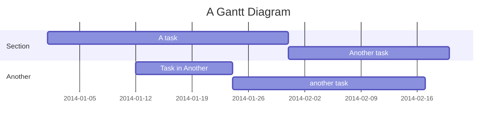
```mermaid
gantt
    title A Gantt Diagram
    dateFormat YYYY-MM-DD
    section Section
        A task          :a1, 2014-01-01, 30d
        Another task    :after a1, 20d
    section Another
        Task in Another :2014-01-12, 12d
        another task    :24d
```

### 饼图

[Mermaid 12.1.0 官方示例](https://github.com/mermaid-js/mermaid/blob/mermaid%4012.1.0/packages/mermaid/src/docs/syntax/pie.md)

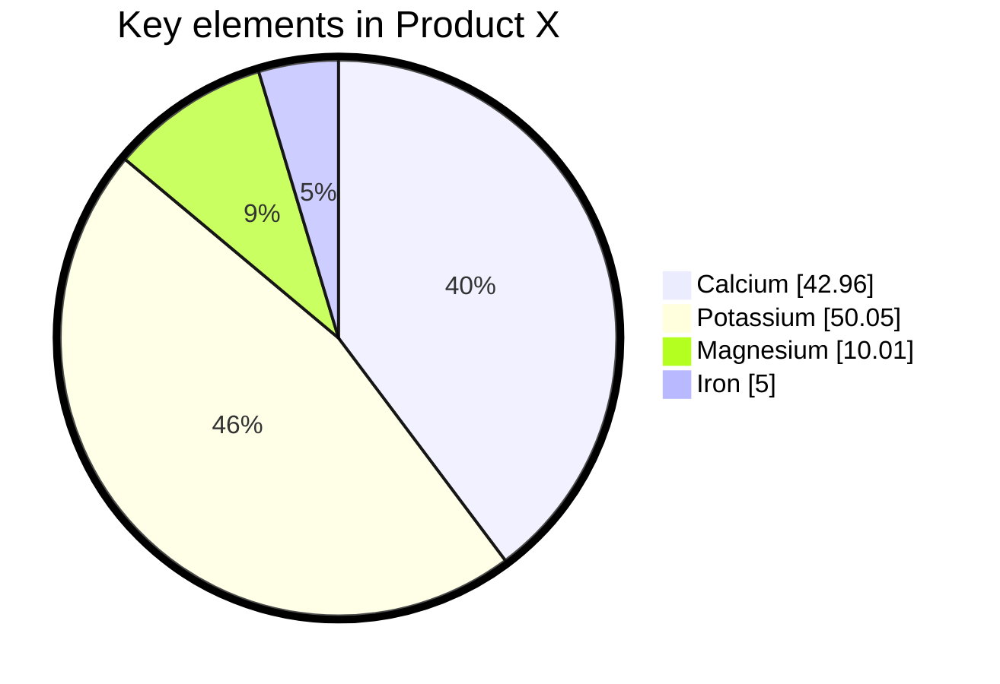
```mermaid
---
config:
  pie:
    textPosition: 0.5
    donutHole: 0.2
    highlightSlice: Potassium
  themeVariables:
    pieOuterStrokeWidth: "5px"
---
pie showData
    title Key elements in Product X
    "Calcium" : 42.96
    "Potassium" : 50.05
    "Magnesium" : 10.01
    "Iron" :  5
```

### 象限图

[Mermaid 12.1.0 官方示例](https://github.com/mermaid-js/mermaid/blob/mermaid%4012.1.0/packages/mermaid/src/docs/syntax/quadrantChart.md)

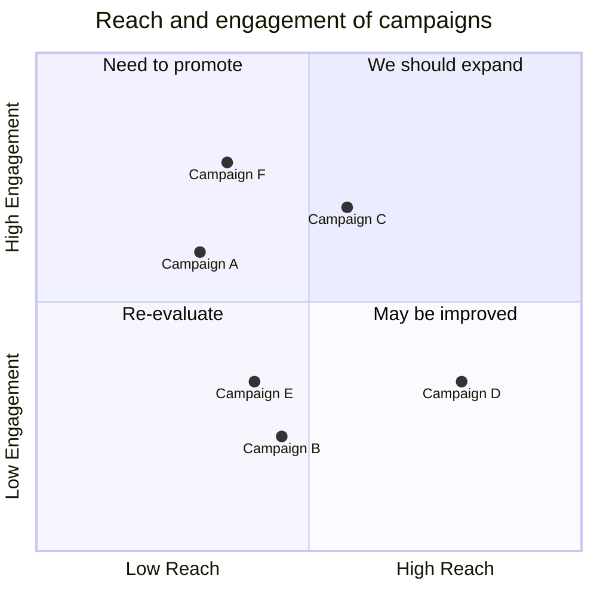
```mermaid
quadrantChart
    title Reach and engagement of campaigns
    x-axis Low Reach --> High Reach
    y-axis Low Engagement --> High Engagement
    quadrant-1 We should expand
    quadrant-2 Need to promote
    quadrant-3 Re-evaluate
    quadrant-4 May be improved
    Campaign A: [0.3, 0.6]
    Campaign B: [0.45, 0.23]
    Campaign C: [0.57, 0.69]
    Campaign D: [0.78, 0.34]
    Campaign E: [0.40, 0.34]
    Campaign F: [0.35, 0.78]
```

### 需求图

[Mermaid 12.1.0 官方示例](https://github.com/mermaid-js/mermaid/blob/mermaid%4012.1.0/packages/mermaid/src/docs/syntax/requirementDiagram.md)

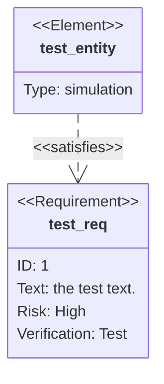
```mermaid
requirementDiagram

    requirement test_req {
    id: 1
    text: the test text.
    risk: high
    verifymethod: test
    }

    element test_entity {
    type: simulation
    }

    test_entity - satisfies -> test_req
```

### Git 分支图

[Mermaid 12.1.0 官方示例](https://github.com/mermaid-js/mermaid/blob/mermaid%4012.1.0/packages/mermaid/src/docs/syntax/gitgraph.md)

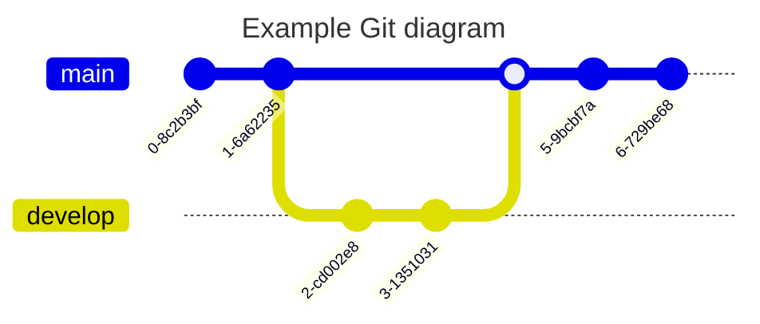
```mermaid
---
title: Example Git diagram
---
gitGraph
   commit
   commit
   branch develop
   checkout develop
   commit
   commit
   checkout main
   merge develop
   commit
   commit
```

### C4 架构图

[Mermaid 12.1.0 官方示例](https://github.com/mermaid-js/mermaid/blob/mermaid%4012.1.0/packages/mermaid/src/docs/syntax/c4.md)

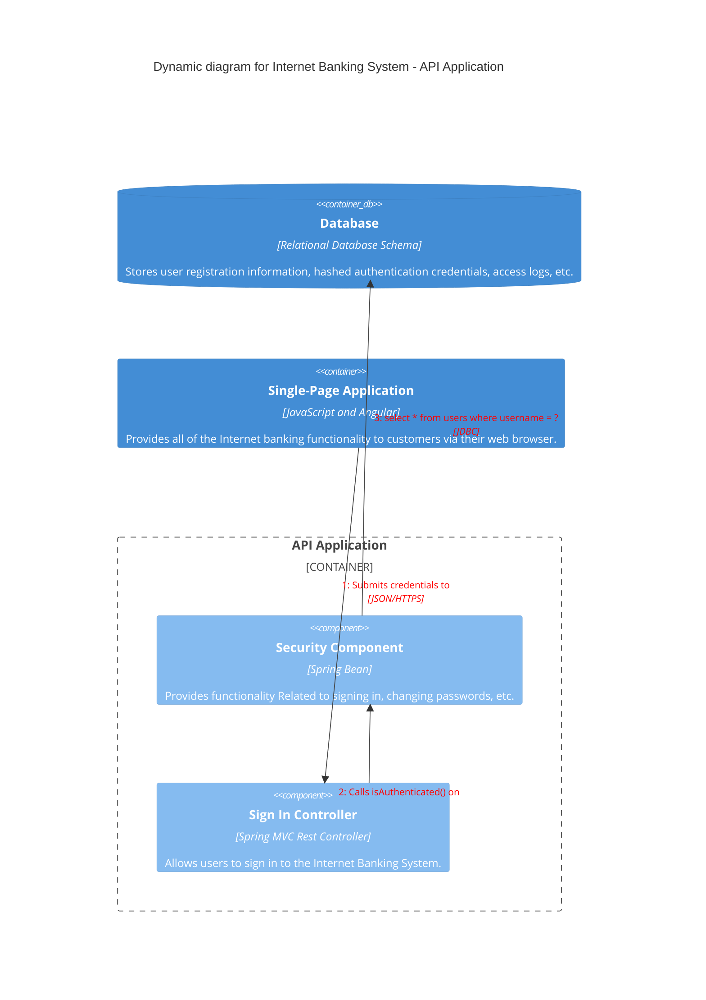
```mermaid
C4Dynamic
    title Dynamic diagram for Internet Banking System - API Application

    ContainerDb(c4, "Database", "Relational Database Schema", "Stores user registration information, hashed authentication credentials, access logs, etc.")
    Container(c1, "Single-Page Application", "JavaScript and Angular", "Provides all of the Internet banking functionality to customers via their web browser.")
    Container_Boundary(b, "API Application") {
      Component(c3, "Security Component", "Spring Bean", "Provides functionality Related to signing in, changing passwords, etc.")
      Component(c2, "Sign In Controller", "Spring MVC Rest Controller", "Allows users to sign in to the Internet Banking System.")
    }
    Rel(c1, c2, "Submits credentials to", "JSON/HTTPS")
    Rel(c2, c3, "Calls isAuthenticated() on")
    Rel(c3, c4, "select * from users where username = ?", "JDBC")

    UpdateRelStyle(c1, c2, $textColor="red", $offsetY="-40")
    UpdateRelStyle(c2, c3, $textColor="red", $offsetX="-40", $offsetY="60")
    UpdateRelStyle(c3, c4, $textColor="red", $offsetY="-40", $offsetX="10")
```

### 思维导图

[Mermaid 12.1.0 官方示例](https://github.com/mermaid-js/mermaid/blob/mermaid%4012.1.0/packages/mermaid/src/docs/syntax/mindmap.md)

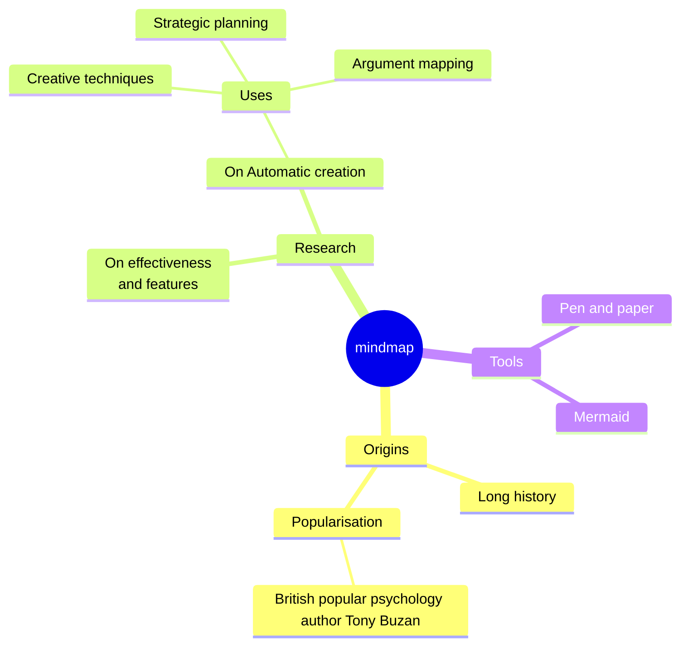
```mermaid
mindmap
  root((mindmap))
    Origins
      Long history
      ::icon(fa fa-book)
      Popularisation
        British popular psychology author Tony Buzan
    Research
      On effectiveness<br/>and features
      On Automatic creation
        Uses
            Creative techniques
            Strategic planning
            Argument mapping
    Tools
      Pen and paper
      Mermaid
```

### 时间线

[Mermaid 12.1.0 官方示例](https://github.com/mermaid-js/mermaid/blob/mermaid%4012.1.0/packages/mermaid/src/docs/syntax/timeline.md)

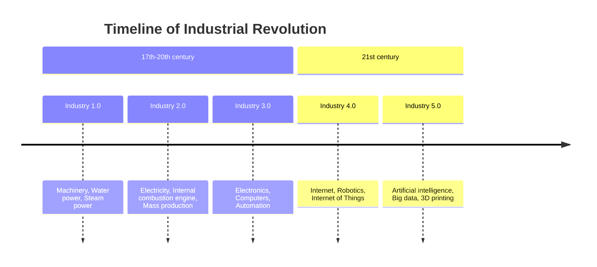
```mermaid
timeline
    title Timeline of Industrial Revolution
    section 17th-20th century
        Industry 1.0 : Machinery, Water power, Steam <br>power
        Industry 2.0 : Electricity, Internal combustion engine, Mass production
        Industry 3.0 : Electronics, Computers, Automation
    section 21st century
        Industry 4.0 : Internet, Robotics, Internet of Things
        Industry 5.0 : Artificial intelligence, Big data, 3D printing
```

### 桑基图

[Mermaid 12.1.0 官方示例](https://github.com/mermaid-js/mermaid/blob/mermaid%4012.1.0/packages/mermaid/src/docs/syntax/sankey.md)

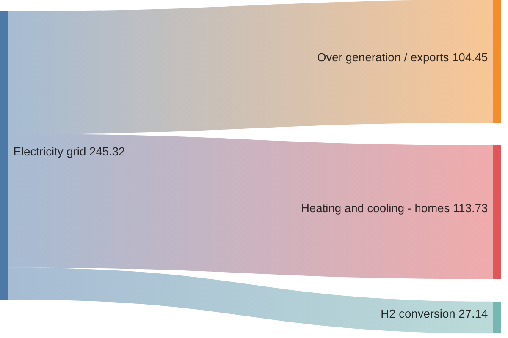
```mermaid
sankey

%% source,target,value
Electricity grid,Over generation / exports,104.453
Electricity grid,Heating and cooling - homes,113.726
Electricity grid,H2 conversion,27.14
```

### XY 图表

[Mermaid 12.1.0 官方示例](https://github.com/mermaid-js/mermaid/blob/mermaid%4012.1.0/packages/mermaid/src/docs/syntax/xyChart.md)

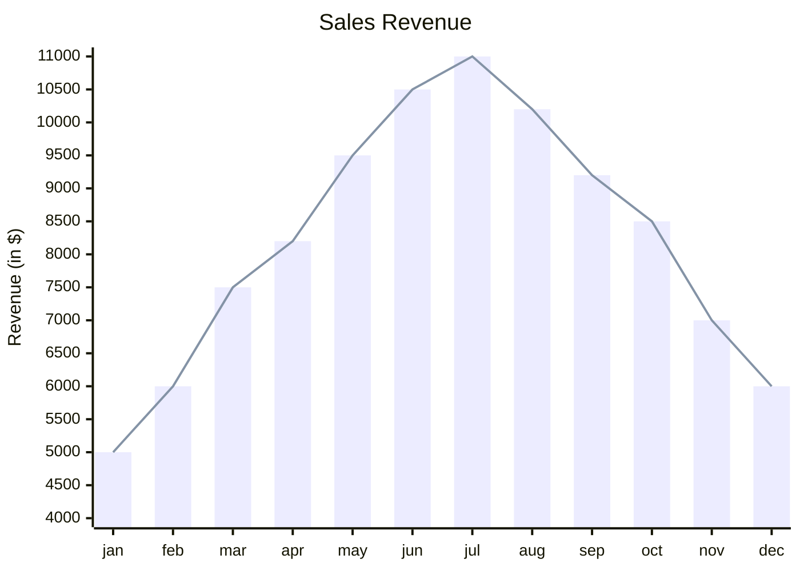
```mermaid
xychart
    title "Sales Revenue"
    x-axis [jan, feb, mar, apr, may, jun, jul, aug, sep, oct, nov, dec]
    y-axis "Revenue (in $)" 4000 --> 11000
    bar [5000, 6000, 7500, 8200, 9500, 10500, 11000, 10200, 9200, 8500, 7000, 6000]
    line [5000, 6000, 7500, 8200, 9500, 10500, 11000, 10200, 9200, 8500, 7000, 6000]
```

### 块图

[Mermaid 12.1.0 官方示例](https://github.com/mermaid-js/mermaid/blob/mermaid%4012.1.0/packages/mermaid/src/docs/syntax/block.md)

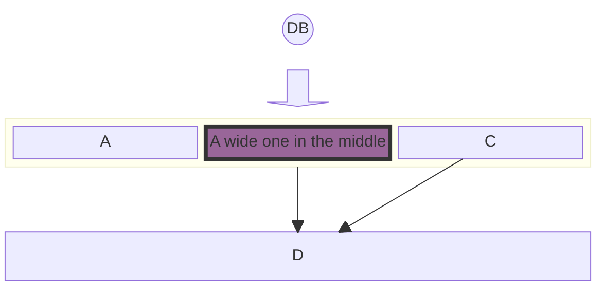
```mermaid
block
columns 1
  db(("DB"))
  blockArrowId6<["&nbsp;&nbsp;&nbsp;"]>(down)
  block:ID
    A
    B["A wide one in the middle"]
    C
  end
  space
  D
  ID --> D
  C --> D
  style B fill:#969,stroke:#333,stroke-width:4px
```

### 数据包

[Mermaid 12.1.0 官方示例](https://github.com/mermaid-js/mermaid/blob/mermaid%4012.1.0/packages/mermaid/src/docs/syntax/packet.md)

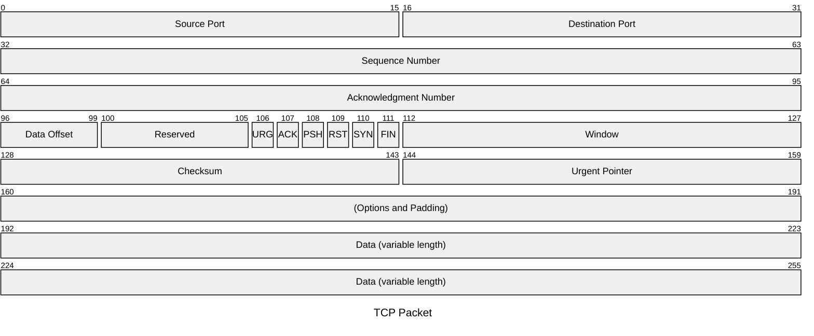
```mermaid
---
title: "TCP Packet"
---
packet
0-15: "Source Port"
16-31: "Destination Port"
32-63: "Sequence Number"
64-95: "Acknowledgment Number"
96-99: "Data Offset"
100-105: "Reserved"
106: "URG"
107: "ACK"
108: "PSH"
109: "RST"
110: "SYN"
111: "FIN"
112-127: "Window"
128-143: "Checksum"
144-159: "Urgent Pointer"
160-191: "(Options and Padding)"
192-255: "Data (variable length)"
```

### 看板

[Mermaid 12.1.0 官方示例](https://github.com/mermaid-js/mermaid/blob/mermaid%4012.1.0/packages/mermaid/src/docs/syntax/kanban.md)

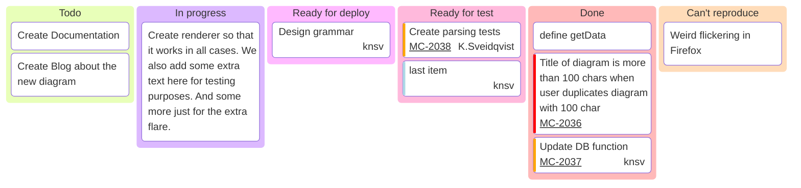
```mermaid
---
config:
  kanban:
    ticketBaseUrl: 'https://mermaidchart.atlassian.net/browse/#TICKET#'
---
kanban
  Todo
    [Create Documentation]
    docs[Create Blog about the new diagram]
  [In progress]
    id6[Create renderer so that it works in all cases. We also add some extra text here for testing purposes. And some more just for the extra flare.]
  id9[Ready for deploy]
    id8[Design grammar]@{ assigned: 'knsv' }
  id10[Ready for test]
    id4[Create parsing tests]@{ ticket: MC-2038, assigned: 'K.Sveidqvist', priority: 'High' }
    id66[last item]@{ priority: 'Very Low', assigned: 'knsv' }
  id11[Done]
    id5[define getData]
    id2[Title of diagram is more than 100 chars when user duplicates diagram with 100 char]@{ ticket: MC-2036, priority: 'Very High'}
    id3[Update DB function]@{ ticket: MC-2037, assigned: knsv, priority: 'High' }

  id12[Can't reproduce]
    id3[Weird flickering in Firefox]
```

### 架构图

[Mermaid 12.1.0 官方示例](https://github.com/mermaid-js/mermaid/blob/mermaid%4012.1.0/packages/mermaid/src/docs/syntax/architecture.md)

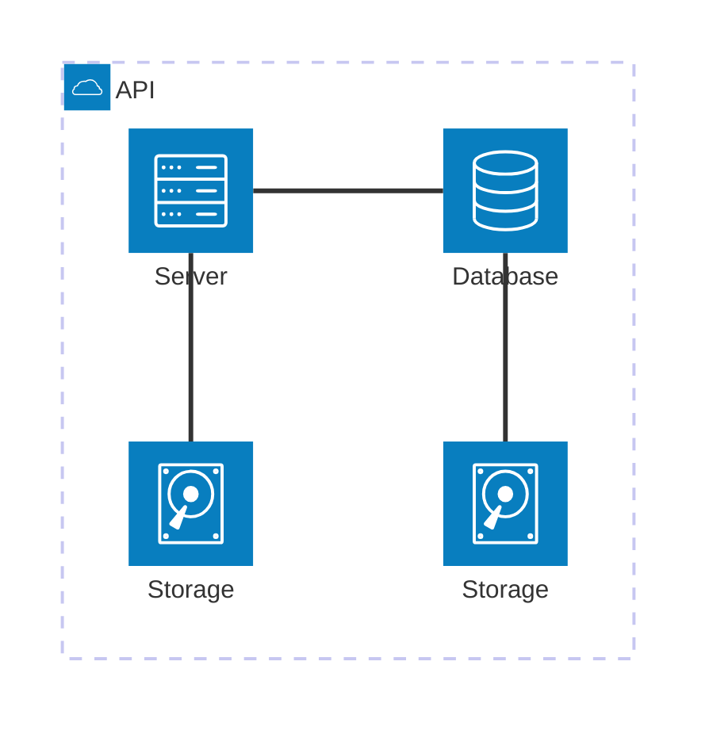
```mermaid
architecture-beta
    group api(cloud)[API]

    service db(database)[Database] in api
    service disk1(disk)[Storage] in api
    service disk2(disk)[Storage] in api
    service server(server)[Server] in api

    db:L -- R:server
    disk1:T -- B:server
    disk2:T -- B:db
```

### 雷达图

[Mermaid 12.1.0 官方示例](https://github.com/mermaid-js/mermaid/blob/mermaid%4012.1.0/packages/mermaid/src/docs/syntax/radar.md)

```mermaid
---
title: "Grades"
---
radar-beta
  axis m["Math"], s["Science"], e["English"]
  axis h["History"], g["Geography"], a["Art"]
  curve a["Alice"]{85, 90, 80, 70, 75, 90}
  curve b["Bob"]{70, 75, 85, 80, 90, 85}

  max 100
  min 0
```

### 树状矩形图

[Mermaid 12.1.0 官方示例](https://github.com/mermaid-js/mermaid/blob/mermaid%4012.1.0/packages/mermaid/src/docs/syntax/treemap.md)

```mermaid
treemap-beta
"Products"
    "Electronics"
        "Phones": 50
        "Computers": 30
        "Accessories": 20
    "Clothing"
        "Men's": 40
        "Women's": 40
```

### 韦恩图

[Mermaid 12.1.0 官方示例](https://github.com/mermaid-js/mermaid/blob/mermaid%4012.1.0/packages/mermaid/src/docs/syntax/venn.md)

```mermaid
venn-beta
  title What makes a good feature
  set Desirable
  set Feasible
  set Viable
  union Desirable,Feasible["Buildable"]
  union Feasible,Viable["Sustainable"]
  union Desirable,Viable["Marketable"]
  union Desirable,Feasible,Viable["Ship it"]
```

### 鱼骨图

[Mermaid 12.1.0 官方示例](https://github.com/mermaid-js/mermaid/blob/mermaid%4012.1.0/packages/mermaid/src/docs/syntax/ishikawa.md)

```mermaid
ishikawa-beta
    Blurry Photo
    Process
        Out of focus
        Shutter speed too slow
        Protective film not removed
        Beautification filter applied
    User
        Shaky hands
    Equipment
        LENS
            Inappropriate lens
            Damaged lens
            Dirty lens
        SENSOR
            Damaged sensor
            Dirty sensor
    Environment
        Subject moved too quickly
        Too dark
```

## 补充交互与边界测试

### 响应式长链与中文长标签

将窗口缩到约 400px，再恢复到 1000px。观察布局方向、节点间距和文字换行；实时渲染开关应影响更新延迟。

```mermaid
flowchart LR
  A[用户打开包含多个图表的 Markdown 文档] --> B[Typora 读取代码块源码]
  B --> C{当前窗口是否足够宽？}
  C -->|足够宽| D[横向呈现完整的处理流程]
  C -->|空间不足| E[重新布局并保持标签可读]
  D --> F[导出并检查 SVG]
  E --> F
```

### 新形状、子图、虚线与主题覆盖

形状语法参考 [12.1.0 流程图文档](https://github.com/mermaid-js/mermaid/blob/mermaid%4012.1.0/packages/mermaid/src/docs/syntax/flowchart.md)。固定颜色应覆盖主题配色，其他节点继续使用当前主题。

```mermaid
flowchart TB
  subgraph input[输入阶段]
    A@{ shape: manual-input, label: "手动输入" }
    B@{ shape: docs, label: "多份文档" }
  end
  subgraph processing[处理阶段]
    C@{ shape: procs, label: "处理队列" }
    D@{ shape: cyl, label: "数据库" }
  end
  A --> C
  B -.-> C
  C ==> D
  classDef highlighted fill:#fff3cd,stroke:#9a6700,color:#332200
  class C highlighted
```

### 相同节点 ID 的两个图表

两个图都使用 A、B，但标签和方向不同；前后编辑不应串图。

```mermaid
flowchart LR
  A[第一张图] --> B[横向终点]
```

```mermaid
flowchart TB
  A[第二张图] --> B[纵向终点]
```

### 中文、Emoji、转义文本与可访问性

尖括号文本应作为标签显示，不执行脚本。导出后检查 SVG 的标题和描述。

```mermaid
flowchart LR
  accTitle: 中文与特殊字符测试
  accDescr: 包含中文、Emoji、引号和转义尖括号的流程图。
  A["中文 🌋 Pele"] --> B["引号 #quot;hello#quot; 与 A &amp; B"]
  B --> C["&lt;script&gt;alert(1)&lt;/script&gt;"]
```

### 链接

仅在主动点击节点时才应打开 Mermaid 官网。

```mermaid
flowchart LR
  A[Mermaid 官方文档] --> B[普通节点]
  click A "https://mermaid.js.org/" "打开 Mermaid 官网"
```

### LaTeX 数学标签

复用 Typora 内置 MathJax 排版。检查公式完整显示、节点尺寸足够、宽窄布局和亮暗主题切换后保持清晰；导出 HTML/PDF 后不应缺失字形。类成员和图表标题不属于 Pele 的数学标签排版范围。

```mermaid
flowchart LR
  A["$$E=mc^2$$"] --> B["$$a^2+b^2=c^2$$"]
```

## 预期失败

以下两块刻意写错，出现错误是正常结果。修正源码后，应恢复预览。

### 未闭合的节点标签

将第二行改为 `A[已修复] --> B[恢复渲染]` 后应正常显示。

```mermaid
flowchart LR
  A[Unclosed label
```

### 未知图表类型

将内容替换为 `flowchart LR` 加一行 `A --> B` 后应正常显示。

```mermaid
notADiagram
  this should report an error
```

### 错误块后面的正常图表

即使上面的错误仍存在，本图也必须正常显示。

```mermaid
flowchart LR
  A[前面的错误已隔离] --> B[其他图表正常渲染]
```

## LaTeX 补充支持

### 分式、根式、求和与矩阵

```mermaid
flowchart LR
  A["$$\dfrac{-b\pm\sqrt{b^2-4ac}}{2a}$$"] --> B["$$\sum_{i=1}^{n} i=\frac{n(n+1)}{2}$$"]
  B --> C["$$\begin{pmatrix}a&b\\c&d\end{pmatrix}$$"]
```

### 时序图中的公式

```mermaid
sequenceDiagram
  participant A as Alice
  participant B as Bob
  A->>B: $$E=mc^2$$
  B-->>A: $$\int_0^1 x^2\,dx=\frac{1}{3}$$
```

### 重复公式与错误公式降级

相同公式应可在多个节点中独立显示。错误公式应显示源码而不导致整张图消失。

```mermaid
flowchart TB
  A["$$x^2+y^2=z^2$$"] --> B["$$x^2+y^2=z^2$$"]
  B --> C["$$\frac{1}{$$"]
  C --> D[其他节点正常渲染]
```
